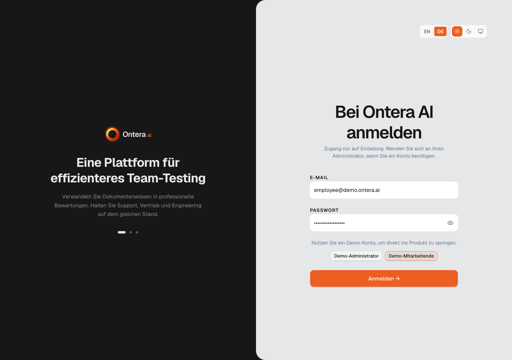

# Ontera AI

**AI-powered employee knowledge assessment platform** that transforms internal documentation into reviewable tests, personalized feedback, and learning analytics.

Upload documents → AI generates structured tests → Assign to employees → Track progress.



---

## Features

**AI / RAG Pipeline**

- Upload documents (PDF, DOCX, TXT) → AI text extraction → chunking → pgvector embeddings (1536d)
- Semantic search over document chunks for context-aware test generation
- AI-generated structured tests with validated question formats (single/multiple choice, true/false)
- AI topic extraction per document
- Multi-document test generation (select multiple source documents)
- AI-generated personalized feedback per attempt
- Adaptive follow-up questions for wrong answers (verify understanding before retake)

**Admin Flow**

- Dashboard with real KPIs (tests assigned, completion rate, avg score, weekly activity chart)
- Document management: upload, AI extraction, version history, archive/delete lifecycle
- Test generation, review, edit, approve/reject/regenerate individual questions
- Manual question addition during review
- Publish readiness checks with atomic publish transaction
- Assign tests to employees with configurable deadlines
- Test detail with questions, assignments, results, lifecycle actions (archive, delete, restore)
- Employee management: invite, nudge reminders, bulk assign tests, bulk archive/delete
- Employee detail: score trends, completed tests, strong/weak topics, attempt history, topic mastery
- Team analytics: avg score, completion rate, weak topics, difficult questions, best/worst performers, department comparison

**Employee Flow**

- Dashboard with next required test, recent feedback, learning focus
- Assigned tests with status badges (not started, in progress, failed, completed)
- Row preview drawer with expand-to-full-page
- Test taking with progress panel, one-by-one answering, submit with incomplete warning
- Result page: score, pass/fail, AI feedback (understood well, needs improvement, recommended next step)
- Answer review with follow-up questions on wrong answers
- Retake policy with configurable max attempts
- Personal progress page: KPIs, strengths, weak topics, attempt history, topic radar
- Source material viewer (scoped document access from test context)

**UX / Infrastructure**

- English / German interface (i18n) with language switcher in navbar and login page
- Light / Dark / System theme with theme toggle
- TanStack DataTable: sort, filter, search, pagination, bulk row selection
- Row preview drawers (Vaul) for documents, tests, employees, employee tests
- Breadcrumbs across all pages
- Toast notifications for all operations (upload, assign, archive, delete, nudge)
- Markdown rendering via react-markdown + remark-gfm
- Login page with carousel, demo account buttons, language + theme switchers

---

## Tech Stack

| Layer      | Choice                                                                                 |
| ---------- | -------------------------------------------------------------------------------------- |
| Framework  | Next.js 16.2 (App Router)                                                              |
| Language   | TypeScript                                                                             |
| Styling    | Tailwind CSS v4                                                                        |
| UI         | shadcn/ui + Radix primitives                                                           |
| Drawers    | Vaul                                                                                   |
| Tables     | TanStack Table                                                                         |
| Charts     | Recharts                                                                               |
| Database   | Supabase PostgreSQL + pgvector                                                         |
| Auth       | Supabase Auth (invite-only, no public registration)                                    |
| AI / RAG   | Vercel AI SDK (`ai` + `@ai-sdk/openai`), OpenAI (gpt-4.1-mini, text-embedding-3-small) |
| Validation | Zod                                                                                    |
| Markdown   | react-markdown + remark-gfm                                                            |
| Toasts     | Sonner                                                                                 |
| Theme      | next-themes                                                                            |
| URL state  | nuqs                                                                                   |
| Icons      | Lucide React                                                                           |

---

## Setup

### Prerequisites

- Node.js 20+
- A Supabase project (with pgvector extension)
- An OpenAI API key

### 1. Environment Variables

```bash
cp .env.example .env.local
```

Required:

| Variable                               | Description                                |
| -------------------------------------- | ------------------------------------------ |
| `NEXT_PUBLIC_SUPABASE_URL`             | Supabase project URL                       |
| `NEXT_PUBLIC_SUPABASE_PUBLISHABLE_KEY` | Supabase anon / publishable key            |
| `SUPABASE_SECRET_KEY`                  | Supabase service_role secret (server-only) |
| `OPENAI_API_KEY`                       | OpenAI API key                             |

Optional:

| Variable                         | Default        | Description                      |
| -------------------------------- | -------------- | -------------------------------- |
| `NEXT_PUBLIC_ENABLE_DEMO_LOGIN`  | `false`        | Show demo login buttons          |
| `MAX_UPLOAD_MB`                  | `10`           | Max file upload size (MB)        |
| `DOCUMENT_TEXT_EXTRACTION_MODEL` | `gpt-4.1-mini` | Model for text extraction        |
| `ATTEMPT_FEEDBACK_MODEL`         | `gpt-4.1-mini` | Model for test feedback          |
| `ATTEMPT_FEEDBACK_TIMEOUT_MS`    | `15000`        | Feedback generation timeout (ms) |
| `FOLLOW_UP_QUESTION_MODEL`       | `gpt-4.1-mini` | Model for follow-up questions    |
| `FOLLOW_UP_QUESTION_TIMEOUT_MS`  | `15000`        | Follow-up question timeout (ms)  |

### 2. Database

Apply migrations in order via Supabase SQL editor or CLI:

```
supabase/migrations/
├── 00001_initial_schema.sql
├── 00002_auth_rls_policies.sql
├── 00003_document_upload_ingestion.sql
├── 00004_document_topics.sql
├── 00005_document_versioning.sql
├── 00006_document_archive_delete_and_test_inactivation.sql
├── 00007_multi_document_tests.sql
├── 00008_review_editor_enhancements.sql
├── 00009_adaptive_follow_up_persistence.sql
├── 00010_test_lifecycle_tombstones.sql
├── 00011_retake_and_transactions.sql
├── 00012_employee_nudge_events.sql
├── 00013_employee_nudge_event_advisor_fixes.sql
├── 00014_retake_rpc_advisor_fixes.sql
```

### 3. Seed Data (Optional)

```bash
# Run supabase/seed.sql to create demo accounts and sample data
```

Creates:

| Role     | Email                     | Password             |
| -------- | ------------------------- | -------------------- |
| Admin    | `admin@demo.ontera.ai`    | `demo-only-password` |
| Employee | `employee@demo.ontera.ai` | `demo-only-password` |

### 4. Generate Embeddings

```bash
npm run embed:demo-chunks
```

### 5. Start Dev Server

```bash
npm run dev
```

Open [http://localhost:3000](http://localhost:3000).

---

## Demo Credentials

| Role     | Email                     | Password             |
| -------- | ------------------------- | -------------------- |
| Admin    | `admin@demo.ontera.ai`    | `demo-only-password` |
| Employee | `employee@demo.ontera.ai` | `demo-only-password` |

Enable with `NEXT_PUBLIC_ENABLE_DEMO_LOGIN=true`.

---

## Routes

### Admin (`/admin/*`)

| Route                                 | Page                                                                                              |
| ------------------------------------- | ------------------------------------------------------------------------------------------------- |
| `/admin/dashboard`                    | KPIs, recent documents, test performance, weekly activity chart, recent attempts                  |
| `/admin/documents`                    | Document list with search/sort/filter, bulk actions, row preview drawer                           |
| `/admin/documents/[id]`               | Document detail: overview, extracted text, topics, metadata, versions, archive/delete             |
| `/admin/documents/[id]/generate-test` | Test configuration: select docs, difficulty, question count, target role, language, passing score |
| `/admin/tests`                        | Test list with search/sort/filter, bulk archive/delete, row preview drawer                        |
| `/admin/tests/[id]`                   | Test detail: questions, assignments, results, lifecycle actions                                   |
| `/admin/tests/[id]/assign`            | Assign test to employees with deadline                                                            |
| `/admin/tests/review`                 | Review/edit/approve/reject AI-generated questions                                                 |
| `/admin/tests/publish`                | Publish readiness checks, summary                                                                 |
| `/admin/employees`                    | Employee list with invite, nudge, assign test, bulk actions                                       |
| `/admin/employees/[id]`               | Employee detail: score trend, completed tests, strong/weak topics, attempt history                |
| `/admin/analytics`                    | Team analytics: avg score, completion rate, weak topics, difficult questions, performers          |

### Employee (`/employee/*`)

| Route                         | Page                                                                      |
| ----------------------------- | ------------------------------------------------------------------------- |
| `/employee/dashboard`         | Next required test, recent feedback, learning focus, reminders            |
| `/employee/tests`             | Assigned tests table with row preview drawer                              |
| `/employee/tests/[id]`        | Test detail preview                                                       |
| `/employee/tests/[id]/take`   | Take test: answer questions, progress panel, submit                       |
| `/employee/tests/[id]/result` | Score, pass/fail, AI feedback, answer review, follow-up questions, retake |
| `/employee/documents/[id]`    | Source material viewer                                                    |
| `/employee/progress`          | Completed tests, strengths, weak topics, attempt history, topic progress  |

### Auth

| Route            | Page                                                           |
| ---------------- | -------------------------------------------------------------- |
| `/login`         | Sign-in with demo accounts, carousel, language/theme switchers |
| `/access-denied` | Access denied page                                             |

---

## Project Structure

```
src/
├── app/                          # Next.js App Router
│   ├── (admin)/admin/            # 12 admin pages
│   ├── (auth)/                   # Login, access denied
│   ├── (employee)/employee/      # 7 employee pages
│   └── api/                      # Route handlers
├── features/
│   ├── auth/                     # Auth, sessions, login
│   ├── documents/                # Document management
│   ├── employees/                # Admin employee management
│   ├── employee/                 # Employee-facing features
│   │   ├── tests/                # Taking, results, progress
│   │   └── documents/            # Source material viewer
│   ├── tests/                    # Generation, review, publish, assign
│   └── analytics/                # Dashboard, analytics
├── shared/
│   ├── components/               # Breadcrumbs, providers
│   ├── i18n/                     # en, de dictionaries + hooks
│   ├── theme/                    # Theme provider + mode selector
│   └── ui/                       # shadcn/ui components + DataTable
└── lib/
    └── supabase/                 # Client, admin client, types
```

---

## Scripts

| Command                     | Description                            |
| --------------------------- | -------------------------------------- |
| `npm run dev`               | Start development server               |
| `npm run build`             | Production build                       |
| `npm run start`             | Start production server                |
| `npm run lint`              | ESLint                                 |
| `npm run format`            | Prettier write                         |
| `npm run format:check`      | Prettier check                         |
| `npm run typecheck`         | TypeScript type check (`tsc --noEmit`) |
| `npm run embed:demo-chunks` | Generate embeddings for demo documents |

---

## Database Schema

| Table                     | Purpose                                                                                                        |
| ------------------------- | -------------------------------------------------------------------------------------------------------------- |
| `organizations`           | Multi-tenant orgs                                                                                              |
| `profiles`                | User profiles (FK to `auth.users`)                                                                             |
| `organization_members`    | Org membership with role (`admin`/`employee`) and status (`invited`/`active`/`disabled`)                       |
| `documents`               | Uploaded source docs with AI-extracted text, versioning, lifecycle status                                      |
| `document_chunks`         | Text chunks with pgvector embeddings (1536d)                                                                   |
| `document_topics`         | AI-extracted topics per document                                                                               |
| `document_version_events` | Immutable audit log of document changes                                                                        |
| `tests`                   | Tests with status (`draft`/`review`/`published`/`archived`/`deleted`), difficulty, passing score, max attempts |
| `test_documents`          | Many-to-many test ↔ document                                                                                   |
| `test_questions`          | Questions with type, options, correct answer, topic, review status                                             |
| `test_assignments`        | Test → employee assignments with status and deadline                                                           |
| `test_attempts`           | Test-taking sessions with score, pass/fail, AI feedback                                                        |
| `test_answers`            | Individual question answers per attempt                                                                        |
| `follow_up_questions`     | AI-generated adaptive follow-up questions                                                                      |
| `follow_up_answers`       | Employee answers to follow-ups                                                                                 |
| `ai_generation_runs`      | AI generation audit log                                                                                        |
| `employee_nudge_events`   | Admin nudge/reminder audit log                                                                                 |
